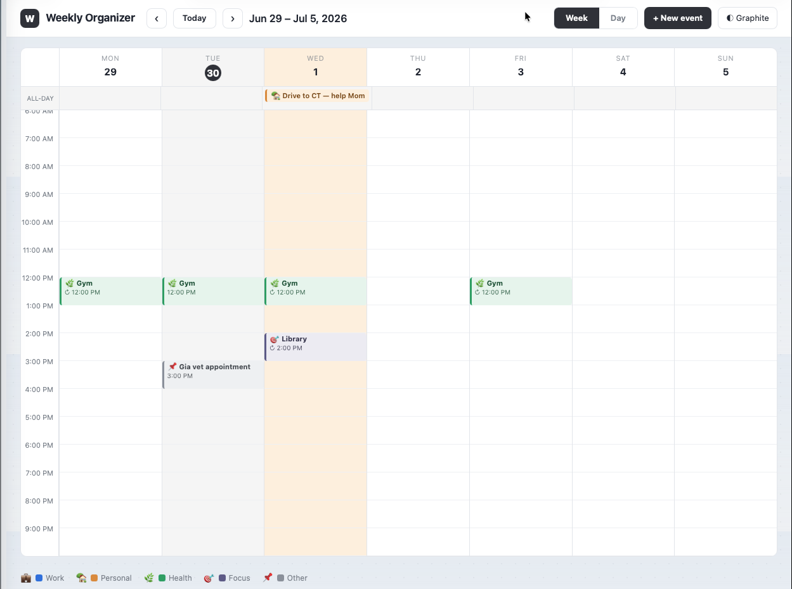
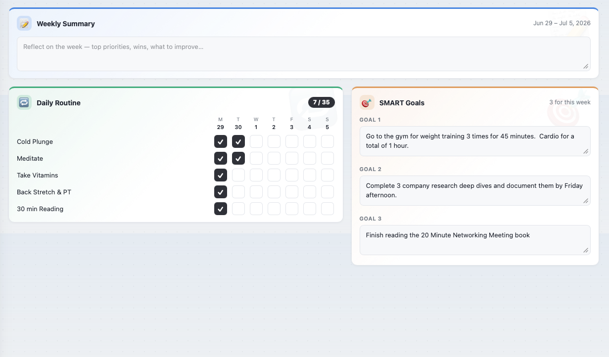

# AI-Assisted GTD — Weekly Organizer

A personal life-organization tool built with Next.js, SQLite, and the Claude API.  Inspired by Microsoft Outlook's calendar.  Designed to run on a local Linux server and be accessible from any device on the home network.

Built by Jason Darrow as portfolio project #2 — demonstrating AI-assisted development and full-stack engineering skills.

---

## What It Does

A single-screen weekly planner with three stacked regions:

**Calendar** — Week view and Day view with a full time grid (6 AM – 10 PM).  Create, edit, and delete events.  Supports all-day events, recurring events (daily or weekly on selected days), overlapping event layout, and per-category color coding.

**Event Modal** — Full create/edit experience: title, day, category, all-day toggle, start/end time, repeat pattern with weekday chips, and reminder settings (phone / email).  Recurring events offer "Save this occurrence" vs "Save all" to handle one-off changes without breaking the series.

**Weekly Planning Panel** — Three themed cards below the calendar:
- **Weekly Summary** — a free-text reflection area, scoped per week
- **Daily Routine** — checkbox grid for 5 daily habits across all 7 days of the week
- **SMART Goals** — three goal text areas scoped per week

All data persists to a local SQLite database.  Theme (Light / Graphite) and navigation position persist across sessions.

---

## Screenshots





---

## Tech Stack

| Layer | Technology |
|-------|-----------|
| Framework | Next.js 16 (App Router) |
| Language | TypeScript |
| Styling | Tailwind CSS + CSS custom properties |
| Database | SQLite via `better-sqlite3` |
| ORM | Drizzle ORM |
| Process manager | PM2 |
| Hosting | Local Linux server (LAN only) |

---

## Project Structure

```
src/
├── app/
│   ├── api/
│   │   ├── events/          # GET all, POST create
│   │   │   └── [id]/        # PUT update, DELETE
│   │   ├── routine/         # GET all, PUT toggle
│   │   ├── summary/[weekStart]/   # GET, PUT
│   │   └── goals/[weekStart]/     # GET, PUT
│   ├── globals.css          # Design tokens (light + graphite), keyframes
│   ├── layout.tsx
│   └── page.tsx             # Main app — state, data loading, event handlers
├── components/
│   ├── Toolbar.tsx          # Sticky nav bar
│   ├── WeekView.tsx         # 7-column calendar grid
│   ├── DayView.tsx          # Single-day view
│   ├── EventModal.tsx       # Create / edit modal
│   └── PlanningPanel.tsx    # Summary, Routine, Goals cards
├── db/
│   ├── index.ts             # Drizzle client (better-sqlite3)
│   └── schema.ts            # Table definitions
└── lib/
    ├── types.ts             # TypeScript types + constants
    └── utils.ts             # Date helpers, recurring event logic, overlap layout
```

---

## Database Schema

| Table | Purpose |
|-------|---------|
| `events` | All calendar events — one-time and recurring |
| `routine` | Checkbox state keyed by `<dayISO>\|<itemIndex>` |
| `routine_items` | Configurable routine item list |
| `week_summary` | Free-text weekly reflection, keyed by week start date |
| `week_goals` | Three SMART goals per week, keyed by week start date |

---

## Running Locally (Mac)

```bash
# Install dependencies
npm install

# Generate and apply DB migrations (first time only)
npx drizzle-kit generate
npx drizzle-kit migrate

# Start dev server
npm run dev
# → http://localhost:3000
```

---

## Deploying to Linux Server

```bash
# From Mac — sync project (excludes node_modules and .next)
rsync -av --exclude node_modules --exclude .next \
  "AI Assisted GTD/gtd-app/" \
  darrowj@192.168.1.246:~/gtd-app/

# On Linux server
cd ~/gtd-app
npm install
npx drizzle-kit migrate     # creates data/gtd.db
npm run build
pm2 start npm --name "gtd" -- start
pm2 startup                 # follow printed command to enable on reboot
pm2 save
```

Access from any device on the network: `http://192.168.1.246:3000`

---

## Planned Features (Waves 2 & 3)

| Feature | Status |
|---------|--------|
| Google Calendar sync | Planned — credentials exist |
| Notion task pull | Planned |
| Claude API morning briefing | Planned — `morning_briefing.py` exists |
| Reminder delivery (push + email) | Planned — settings captured, backend TBD |
| Editable routine items | Planned |

---

## Why I Built This

I manage my week out of a combination of calendar apps, sticky notes, and mental overhead.  None of it stays in one place.  This project is the one place — calendar, habits, and weekly goals on a single screen, running on hardware I own, with no subscription.

The secondary goal: demonstrate that I can build a full-stack AI-assisted web app from scratch.  The design spec was generated with Claude.  The implementation was built collaboratively with Claude Code.  The result is production-quality software running on real infrastructure.

---

*Built by [Jason Darrow](https://jasondarrow.com) · [GitHub](https://github.com/darrowj)*
